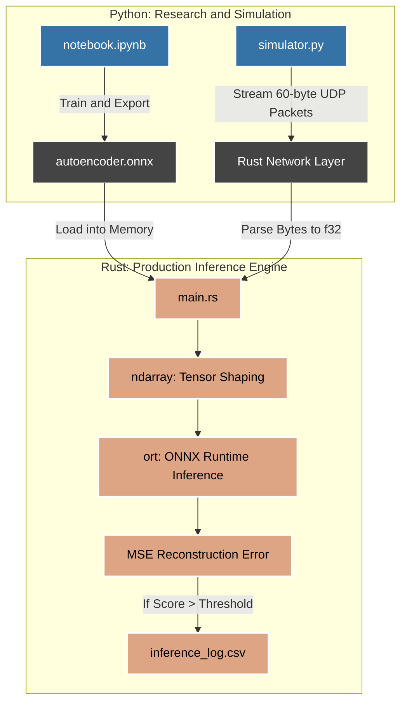

# Real-Time Engine Anomaly Detection

A real-time predictive maintenance system that streams turbofan engine sensor telemetry from Python to a native Rust inference engine. The autoencoder is trained in Python, exported to ONNX, and deployed in Rust via UDP for low-latency anomaly scoring with no Python dependency at inference time.

---

## Architecture



---

## Project Structure

```
telemetry-anomaly-detector/
├── README.md
├── trainer-simulator/              # Python: training and test simulation
│   ├── data/
│   │   └── training_telemetry.csv
│   ├── notebook.ipynb              # EDA, preprocessing, training, ONNX export
│   ├── simulator.py                # UDP packet injector (replays test set)
│   └── requirements.txt
│
└── monitor-engine/                 # Rust: production inference engine
    ├── Cargo.toml
    ├── autoencoder.onnx
    └── src/
        ├── main.rs                 # UDP loop, byte parsing, inference, MSE computation
```

---

## Dataset

NASA CMAPS FD001 (Commercial Modular Aero-Propulsion System Simulation). 100 turbofan engines, each run to failure under a single operating condition. The training set contains 20,631 sensor readings across 21 raw columns.

---

## Design Highlights

**Feature selection by variance.** Seven sensors with near-zero variance across all cycles were removed as they contribute no signal: `sensor_1`, `sensor_5`, `sensor_6`, `sensor_10`, `sensor_16`, `sensor_18`, `sensor_19`. All three operating setting columns were also dropped. The final feature set is 14 sensors.

**Autoencoder trained with L2 regularization.** The bottleneck architecture `14 -> 16 -> 8 -> 4 -> 8 -> 16 -> 14` compresses sensor readings into a 4-dimensional latent space. L2 regularization (`lambda=1e-4`) on all encoder and decoder layers is the key design decision. Without it, the model reconstructs degraded readings as accurately as healthy ones, producing a flat anomaly score over the engine lifetime. With L2, the weight penalty forces the model toward compact representations of the dominant pattern in training data, which is healthy operation. Degraded sensor readings fall outside the learned manifold and produce elevated reconstruction error.

**No labels used during training.** The model is trained with `fit(X, X)` using MSE loss. The autoencoder never sees a degradation label, RUL value, or cycle number during training. It learns only what normal sensor readings look like.

**Reconstruction error as anomaly score.** At inference, MSE between the input vector and its reconstruction is the anomaly score. No additional classification head is needed.

**UDP over TCP for telemetry streaming.** A lost packet in TCP causes the receiver to stall and retry. For real-time telemetry, a stale reading 30ms ago is useless. UDP drops late packets and keeps moving, which matches the deployment requirement.

**Composite ID for packet identification.** Each 60-byte UDP packet carries a 4-byte composite identifier (`unit_number * 1000 + time_in_cycles`) followed by 56 bytes of sensor features (14 x f32, little-endian). This lets the Rust binary log a stable identifier without receiving separate metadata, and the Python analysis layer decodes it back to unit and cycle after the run.

---

## Model Validation

Reconstruction error was computed on the full dataset and plotted against cycle number for each engine. All 9 sampled engines show the same pattern: low stable error during healthy operation, followed by a clear upward trend in the final 20-30% of engine life.

The anomaly score distribution across all 20,631 samples is right-skewed with a peak near 0.004-0.006 and a long tail extending to 0.060. The bulk of the distribution corresponds to healthy cycles. The tail corresponds to degraded cycles near end of life.

**Threshold calibration.** The operating threshold is set at the 95th percentile of reconstruction errors across all training samples, with an exclusion window on the first 10 cycles of engine life. Early cycles produce transient elevated readings as sensors stabilize, which are not indicative of mechanical degradation. The calibrated threshold is approximately 0.035.

---

## Rust Inference Engine

The Rust binary loads `autoencoder.onnx` once at startup using the `ort` crate (ONNX Runtime 2.0). For each received packet it parses the 4-byte composite ID, decodes 14 little-endian f32 values into an `ndarray::Array2<f32>` of shape `(1, 14)`, runs a forward pass through the ONNX session, and computes MSE between input and reconstruction. Results are written to `inference_log.csv` as `composite_id, mse`.

Python reads the log after a test run and decodes composite IDs back to unit and cycle for analysis:

```python
df = pd.read_csv("inference_log.csv")
df['unit_number']    = df['composite_id'] // 1000
df['time_in_cycles'] = df['composite_id'] % 1000
```

---

## Results

| Metric | Value |
|---|---|
| Training loss (MSE with L2) | 0.0183 |
| Reconstruction MSE (healthy cycles) | ~0.004-0.010 |
| Reconstruction MSE (end of life) | ~0.050-0.150 |
| Operating threshold | 0.035 |
| Engines showing correct degradation trend | 9 / 9 validated |

---

## Setup

**Python**
```bash
cd trainer-simulator
pip install -r requirements.txt
jupyter notebook notebook.ipynb
```

**Rust**
```bash
cd monitor-engine
cargo build --release
cargo run --release
```

**Cargo.toml dependencies**
```toml
[dependencies]
ort = { version = "2.0.0-rc.12", features = ["download-binaries"] }
ndarray = "0.16"
```

Run the Python simulator to send packets to the Rust engine:
```bash
python simulator.py
```

---

## Tech Stack

Python 3.11, Keras, NumPy, Pandas, scikit-learn, ONNX, Rust 1.88, `ort` 2.0, `ndarray` 0.16