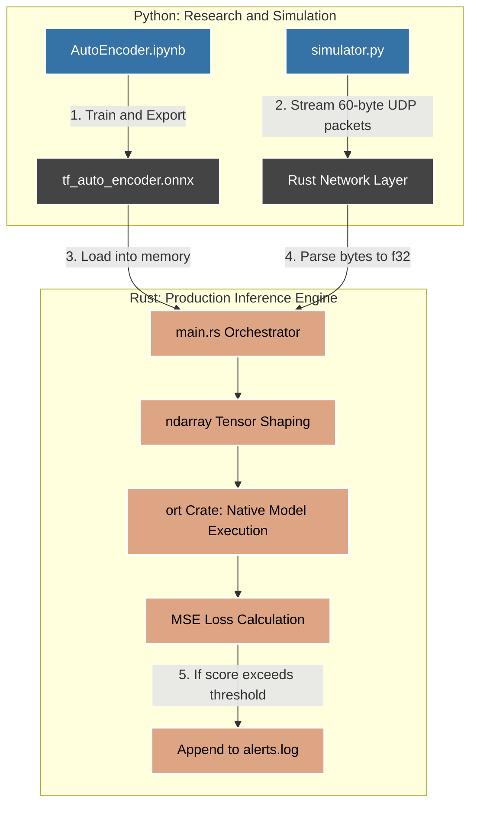

# Telemetry Anomaly Detector


A real-time anomaly detection pipeline for industrial turbofan engines. An Autoencoder is trained in Python on NASA's CMAPSS FD001 degradation dataset, exported to ONNX, and served through a native Rust UDP daemon that performs sub-millisecond inference on live sensor streams.

**Repository:** `github.com/ShivaramHR/telemetry-anomaly-detection` (update if the path differs)

---

## Overview

Most anomaly detection prototypes stop at a Jupyter notebook. This project pushes a trained model into a production-style inference path: a Python side handles research (EDA, training, ONNX export, packet simulation), and a Rust side handles deployment (UDP ingestion, tensor shaping, ONNX execution, reconstruction-error scoring). The goal is to demonstrate the full loop from raw sensor data to a running inference service, not just a model that scores well offline.

## Architecture



## Project Structure

```
telemetry-anomaly-detection/
├── Readme.md                          # Documentation and flowcharts
├── CMAPSSData/                        # Raw engine degradation dataset
│   ├── damage_propagation_modeling.pdf # NASA dataset background and methodology
│   └── readme.txt                     # Dataset instructions
└── Model/                             # Core ML and inference pipeline
    ├── autoencoder.keras              # Native Keras 3 model architecture and weights
    ├── model/                         # Exported deployment models
    │   ├── tf_saved_model/            # Intermediate SavedModel directory format
    │   └── tf_auto_encoder.onnx       # Compiled ONNX execution graph for Rust
    ├── Notebooks/                     # Python research and simulation environment
    │   ├── AutoEncoder.ipynb          # Training pipeline and architecture
    │   ├── EDA.ipynb                  # Exploratory data analysis and preprocessing
    │   ├── test_data_preparation.ipynb # Data split and cleaning logic
    │   └── simulator.py               # 100Hz UDP mock packet injector
    └── rust/                          # Rust side: native production inference
        └── src/
            └── main.rs                # Orchestrator, UDP network layer, ONNX execution
```

---

## How It Works

### Phase 1: Data Preprocessing (Python)

The raw dataset (20,631 rows x 18 columns) was reduced to remove features that carry no signal:

- **Constant-variance sensors dropped:** `sensor_1`, `sensor_5`, `sensor_6`, `sensor_10`, `sensor_16`, `sensor_18`, `sensor_19` do not change over an engine's lifespan and add noise rather than information.
- **Operational settings dropped:** variance close to zero across the fleet.
- **RUL (Remaining Useful Life)** was engineered during analysis, then dropped from the final training set so the model learns from real-time sensor features only, not a label that would not exist at inference time.

Final shape: 20,631 x 14.

### Phase 2: The Autoencoder

Bottleneck architecture: `14 -> 16 -> 8 -> 4 -> 8 -> 14`. The model is trained only on healthy (early-cycle) engine data, so it learns to reconstruct "normal" sensor patterns well and reconstructs degraded patterns poorly. Reconstruction error (MSE) becomes the anomaly signal.

**Problem encountered:** the first version produced a flat reconstruction-loss curve (~0.0039) regardless of engine degradation state. The model was reconstructing everything equally well, which meant it was not learning a meaningful "healthy" manifold.

**Fix:** L2 regularization on the bottleneck layers. This constrained the model enough that it could no longer trivially reconstruct late-cycle (degraded) engines, producing a measurable MSE spike as engines approached failure.

### Phase 3: The Rust Inference Engine

**Why UDP instead of TCP:** in a real-time telemetry context, a dropped packet should be discarded, not retransmitted. TCP would stall the stream to recover a packet that is already stale by the time it arrives. UDP lets the engine skip the loss and process the newest reading immediately, which matters more than guaranteed delivery for this use case.

**Wire protocol (60 bytes per packet):**

| Bytes | Content |
|-------|---------|
| 0-3   | Composite ID: `unit_number * 1000 + time_in_cycles` |
| 4-59  | 14 sensor readings as little-endian f32 (56 bytes) |

The Rust side decodes this with `chunks_exact(4)` and `f32::from_le_bytes`, shapes the result into an `ndarray` tensor, and runs it through the `ort` crate's ONNX runtime for inference.

---

## Roadmap

### Phase 4: Dynamic Thresholding (planned, not yet implemented)

A single static threshold does not hold up across an engine's full lifecycle:

- **0.05:** too conservative. Flagged only 3 of 3,000 points; missed early warning signs.
- **0.03:** too sensitive. Flagged 231 points (7.7%), and 63.9% of those false alarms occurred during the engine's early life (<= 70% of cycle life), where break-in noise is expected and not a sign of degradation.

The planned fix is a threshold that varies with `time_in_cycles` (already available from the composite ID): loose during early cycles to tolerate break-in noise, tightening as the engine ages to catch micro-degradations closer to failure. This is the next piece of work on this project.

## Tech Stack

- **Python** — data analysis, model training (Keras/TensorFlow), ONNX export, packet simulation
- **Rust** — UDP networking, tensor shaping (`ndarray`), inference (`ort`)
- **ONNX** — portable model format bridging the training and inference environments

## Getting Started

**Train and export the model:**
```bash
cd Model/Notebooks
jupyter notebook AutoEncoder.ipynb
# Trains the autoencoder and exports Model/model/tf_auto_encoder.onnx
```

**Run the Rust inference engine:**
```bash
cd Model/rust
cargo build --release
cargo run --release
```

**Simulate a live sensor stream:**
```bash
cd Model/Notebooks
python simulator.py
# Streams 60-byte UDP packets at 100Hz to the Rust engine
```

Anomalies exceeding the reconstruction-error threshold are appended to `alerts.log`.

## Engineering Highlights

- End-to-end ML system, not just a notebook: training, export, and a native inference service are all part of the same repository.
- Diagnosed and fixed a real training failure (flat loss curve masking degradation signal) using L2 regularization, rather than treating a converging loss as automatic success.
- Chose UDP over TCP deliberately, based on the actual latency requirements of the problem rather than defaulting to the more common protocol.
- Built the inference path in Rust for deterministic, low-latency execution, using `ort` for native ONNX inference and `ndarray` for tensor shaping.
- Identified a threshold miscalibration through direct analysis of false-alarm distribution across engine lifecycle stage, and designed a dynamic thresholding scheme to address it.

## License
MIT