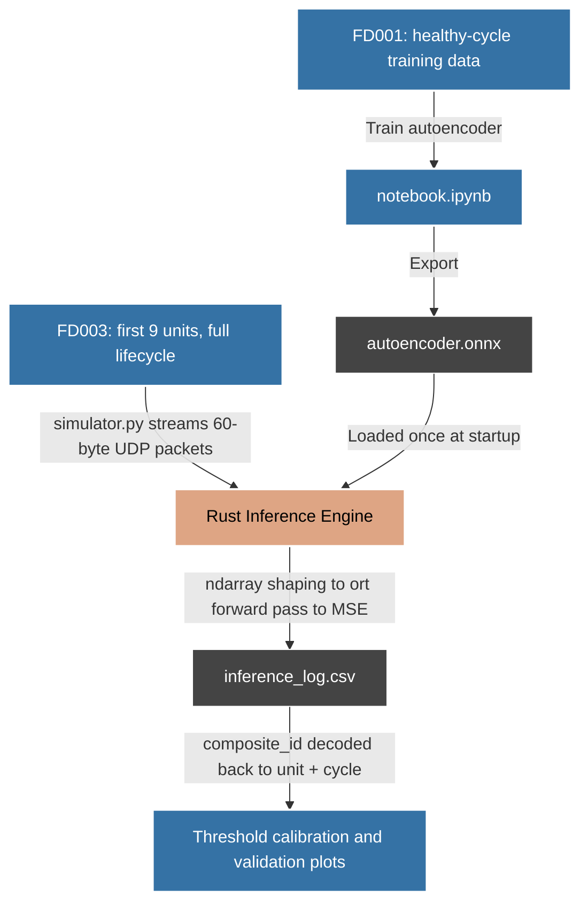

# Telemetry Anomaly Detector

A real-time predictive maintenance system that streams turbofan engine sensor telemetry from Python to a native Rust inference engine over UDP. An autoencoder is trained in Python on NASA's CMAPS dataset, exported to ONNX, and deployed in Rust for low-latency anomaly scoring with no Python dependency at inference time.

---

## Architecture



---

## Project Structure

```
telemetry-anomaly-detector/
├── README.md
├── trainer-simulator/              # Python: training and evaluation
│   ├── data/
│   │   └── training_telemetry.csv
│   ├── notebook.ipynb              # EDA, preprocessing, training, ONNX export, validation
│   ├── simulator.py                # UDP packet injector (streams engine telemetry)
│   └── requirements.txt
│
└── monitor-engine/                 # Rust: production inference engine
    ├── Cargo.toml
    ├── autoencoder.onnx
    └── src/
        ├── main.rs                 # UDP loop, byte parsing, inference, MSE, threshold
        └── network.rs              # Socket binding and packet ingestion
```

---

## Dataset & Training

NASA CMAPS (Commercial Modular Aero-Propulsion System Simulation). The autoencoder is trained on the FD001 training split — 100 turbofan engines, 20,631 total readings across 21 raw sensors and 3 operating-condition settings.

**Feature selection.** Seven sensors with near-zero variance across all cycles were dropped as they carry no signal: `sensor_1`, `sensor_5`, `sensor_6`, `sensor_10`, `sensor_16`, `sensor_18`, `sensor_19`. All three operating-setting columns were also dropped for the same reason. This leaves 14 sensor features.

**Training data is restricted to healthy cycles only.** The autoencoder is trained exclusively on early-life (pre-degradation) cycles from each engine. It never sees a degraded sensor reading during training. At inference, a reading that falls outside the learned "normal operation" manifold produces high reconstruction error this is the entire anomaly signal, and no failure labels are needed to produce it.

**No labels are used during training.** The model is trained with `fit(X, X)` under MSE loss. `degradation_state` (computed as `time_in_cycles / max_cycles` per engine) and RUL are computed and retained in the dataset only for post-training validation plots — never as a training target.

Final training matrix shape: `(20631, 14)`.

### A note on evaluation data

CMAPS's official test splits (e.g. `test_FD001`) are deliberately truncated before each engine fails they're built for the dataset's original task of predicting *remaining* useful life, where the true failure point is withheld in a separate `RUL_FD001.txt` file. Evaluating an anomaly detector on this data is misleading: a model can look inconclusive not because it's wrong, but because the test rows simply never reach genuine end-of-life behavior.

Once this was identified, evaluation was moved to the **first 9 engines of the FD003 training split**, which contains full run-to-failure trajectories under the same single operating condition as FD001. This gives a genuine view of reconstruction error across an engine's complete lifecycle, including true failure. One caveat worth noting: FD003 introduces a second fault mode (fan degradation in addition to HPC degradation) not present in FD001's training data, so this evaluation demonstrates generalization to unseen data rather than a like-for-like train/test split.

---

## Design Highlights

**L2 regularization.** An earlier version of the autoencoder trained on the full dataset (healthy and degraded cycles together), without weight regularization produced a flat reconstruction-error signal that didn't separate healthy from degraded engines; the model had simply learned to reconstruct both equally well. Adding L2 regularization (encoder/decoder weights) forced the model toward a more compact representation of the dominant pattern in the training data, which improved separation. Restricting training data to healthy cycles only (above) is the more direct fix for the same underlying problem, and is retained alongside L2 in the final configuration.

**Composite packet ID.** Each UDP packet is 60 bytes: a 4-byte composite identifier (`unit_number * 1000 + time_in_cycles`) followed by 56 bytes of sensor data (14 × f32, little-endian). This lets the Rust binary log a stable, decodable identifier per packet without needing separate metadata fields, and lets Python reconstruct unit and cycle after a run purely from the log.

**UDP over TCP for telemetry streaming.** A dropped packet under TCP stalls the connection while it's retransmitted, delaying everything behind it. For real-time telemetry, a sensor reading from 30ms ago is already stale by the time a retry would deliver it the system needs the most current reading, not a guaranteed-complete history. UDP delivers what arrives and moves on, which matches that requirement.

---

## Model Validation

Two validation passes were run against the final (healthy-only, L2-regularized) model:

**Against FD001 test data** (still subject to the truncation caveat above, but useful as a like-for-like comparison against the earlier model): reconstruction error rises to roughly **0.6** by the end of the available window, compared to a peak of roughly **0.12–0.15** for the earlier full-dataset-trained model on the same data — a clear improvement in separation, even on a test set that doesn't reach true failure.

**Against FD003, first 9 engines** (full run-to-failure trajectories): reconstruction error stays low and largely flat through the bulk of each engine's operating life, then rises sharply in the final stretch before failure, peaking above **1.5** for some sampled eengines and **0.2 - 0.3** for the others.

### Threshold calibration

The final operating threshold was calibrated empirically against the observed FD003 error distribution, rather than through a formal precision/recall or ROC sweep:

| Cycle range | Threshold |
|---|---|
| Early-life cycles | 0.20 |
| All other cycles | 0.175 |

| Metric | Value |
|---|---|
| Total data points evaluated (9 engines) | 2,594 |
| Flagged as anomalous | 422 (16.3%) |
| Regular (below threshold) | 2,172 |

The flagged rate looks high in aggregate, but it isn't 422 isolated false alarms spread across otherwise-healthy engines. A handful of engines in this sample reach reconstruction error above 2.0 and *stay* elevated for many consecutive cycles once true degradation sets in those engines alone account for a large share of the flagged count. The rest of the sample sits comfortably in the 0.2–0.3 range nearing end of its lifetime.

---

## Rust Inference Engine

The Rust binary loads `autoencoder.onnx` once at startup using the `ort` crate (ONNX Runtime 2.0). For each received packet, it parses the 4-byte composite ID, decodes 14 little-endian f32 values into an `ndarray::Array2<f32>` of shape `(1, 14)`, runs a forward pass through the ONNX session, and computes MSE between input and reconstruction. Results are logged to `inference_log.csv` as `composite_id, mse` for every packet received — not just the ones that cross the threshold — so the full error trace can be reconstructed and analyzed afterward.

```python
# Python: decoding the log after a run
df = pd.read_csv("inference_log.csv")
df["unit_number"]    = df["composite_id"] // 1000
df["time_in_cycles"] = df["composite_id"] % 1000
```

---

## Limitations & Future Work

This project is considered complete at its current configuration. Known limitations and natural next steps:

- **Threshold selection was empirical, not systematic.** A formal precision/recall or ROC-based sweep against labeled failure windows would give a more defensible operating point than the current visually-calibrated values.
- **Evaluation covers 9 of FD003's engines**, not the full set. Extending to all FD003 engines, or to FD002/FD004 (which add operating-condition variation), would give a stronger generalization claim.
- **A single global threshold** doesn't account for engines with a naturally elevated healthy-phase baseline. A per-engine adaptive threshold was considered and deliberately left out of scope for this iteration, since it requires tracking rolling state per engine in the Rust binary a reasonable next step, but a different, larger project.

---

## Setup

**Python**
```bash
cd trainer-simulator
pip install -r requirements.txt
jupyter notebook notebook.ipynb
```

**Rust**
```bash
cd monitor-engine
cargo build --release
cargo run --release
```

**Cargo.toml dependencies**
```toml
[dependencies]
ort = { version = "2.0.0-rc.12", features = ["download-binaries"] }
ndarray = "0.16"
```

Run the Python simulator to stream packets to the Rust engine:
```bash
python simulator.py
```

---

## Tech Stack

Python 3.11, Keras (TensorFlow), NumPy, Pandas, scikit-learn, ONNX, Rust 1.88, `ort` 2.0, `ndarray` 0.16